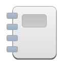

<p align="center">
    
    <h1 class="rich-diff-level-zero">Scribble</h1>
</p>

Manage your notes


## Build
Requires sqlite3:
```shell
sudo apt-get install libsqlite3-dev
```
Build with meson and ninja:
```shell
meson build --prefix=/usr
cd build
ninja
```
Install and execute:
```shell
ninja install
com.thattonybo.scribble
```

## Flatpak
Ensure the SDK is installed:
```shell
flatpak install --user io.elementary.Sdk//7.2
```
Build with flatpak-builder:
```shell
flatpak-builder flatpak-build com.thattonybo.scribble.yml --user --install --force-clean
```
